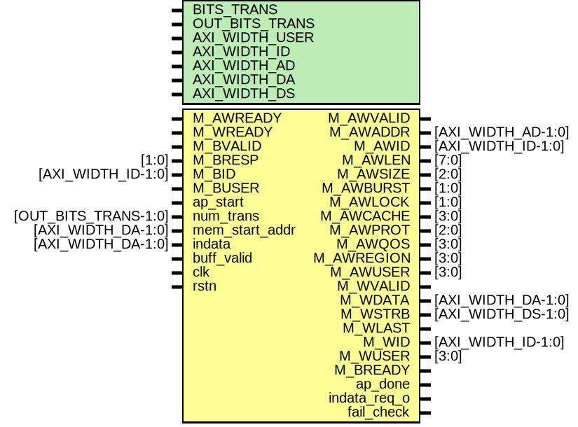

# Entity: axi_dma_wr 

- **File**: axi_dma_wr.v
## Diagram

## Generics

| Generic name   | Type | Value     | Description |
| -------------- | ---- | --------- | ----------- |
| BITS_TRANS     |      | 18        |             |
| OUT_BITS_TRANS |      | 13        |             |
| AXI_WIDTH_USER |      | 1         |             |
| AXI_WIDTH_ID   |      | 4         |             |
| AXI_WIDTH_AD   |      | 32        |             |
| AXI_WIDTH_DA   |      | 32        |             |
| AXI_WIDTH_DS   |      | undefined |             |
## Ports

| Port name      | Direction | Type                 | Description |
| -------------- | --------- | -------------------- | ----------- |
| M_AWVALID      | output    |                      |             |
| M_AWREADY      | input     |                      |             |
| M_AWADDR       | output    | [AXI_WIDTH_AD-1:0]   |             |
| M_AWID         | output    | [AXI_WIDTH_ID-1:0]   |             |
| M_AWLEN        | output    | [7:0]                |             |
| M_AWSIZE       | output    | [2:0]                |             |
| M_AWBURST      | output    | [1:0]                |             |
| M_AWLOCK       | output    | [1:0]                |             |
| M_AWCACHE      | output    | [3:0]                |             |
| M_AWPROT       | output    | [2:0]                |             |
| M_AWQOS        | output    | [3:0]                |             |
| M_AWREGION     | output    | [3:0]                |             |
| M_AWUSER       | output    | [3:0]                |             |
| M_WVALID       | output    |                      |             |
| M_WREADY       | input     |                      |             |
| M_WDATA        | output    | [AXI_WIDTH_DA-1:0]   |             |
| M_WSTRB        | output    | [AXI_WIDTH_DS-1:0]   |             |
| M_WLAST        | output    |                      |             |
| M_WID          | output    | [AXI_WIDTH_ID-1:0]   |             |
| M_WUSER        | output    | [3:0]                |             |
| M_BVALID       | input     |                      |             |
| M_BREADY       | output    |                      |             |
| M_BRESP        | input     | [1:0]                |             |
| M_BID          | input     | [AXI_WIDTH_ID-1:0]   |             |
| M_BUSER        | input     |                      |             |
| ap_start       | input     |                      |             |
| ap_done        | output    |                      |             |
| num_trans      | input     | [OUT_BITS_TRANS-1:0] |             |
| mem_start_addr | input     | [AXI_WIDTH_DA-1:0]   |             |
| indata         | input     | [AXI_WIDTH_DA-1:0]   |             |
| indata_req_o   | output    |                      |             |
| buff_valid     | input     |                      |             |
| fail_check     | output    |                      |             |
| clk            | input     |                      |             |
| rstn           | input     |                      |             |
## Signals

| Name              | Type                       | Description |
| ----------------- | -------------------------- | ----------- |
| ext_awaddr        | reg     [AXI_WIDTH_AD-1:0] |             |
| ext_awlen         | reg     [7:0]              |             |
| ext_awsize        | reg     [2:0]              |             |
| ext_awvalid       | reg                        |             |
| ext_awready       | wire                       |             |
| ext_wdata         | reg     [AXI_WIDTH_DA-1:0] |             |
| ext_wstrb         | reg     [AXI_WIDTH_DS-1:0] |             |
| ext_wlast         | reg                        |             |
| ext_wvalid        | reg                        |             |
| ext_wready        | wire                       |             |
| ext_bid           | wire [AXI_WIDTH_ID-1:0]    |             |
| ext_bresp         | wire [1:0]                 |             |
| ext_bvalid        | wire                       |             |
| ext_bready        | reg                        |             |
| num_trans_d       | reg [OUT_BITS_TRANS-1:0]   |             |
| d_beat_cnt_wr     | reg [7:0]                  |             |
| q_beat_cnt_wr     | reg [7:0]                  |             |
| d_burst_cnt_wr    | reg [OUT_BITS_TRANS-1:0]   |             |
| q_burst_cnt_wr    | reg [OUT_BITS_TRANS-1:0]   |             |
| q_burst_size_wr   | reg [7:0]                  |             |
| q_burst_size_wr_1 | reg [8:0]                  |             |
| q_ext_addr_wr     | reg [AXI_WIDTH_AD-1:0]     |             |
| st_wr2axi         | reg [2:0]                  |             |
| next_st_wr2axi    | reg [2:0]                  |             |
## Constants

| Name             | Type | Value                    | Description |
| ---------------- | ---- | ------------------------ | ----------- |
| FIXED_BURST_SIZE |      | 256                      |             |
| DEFAULT_ID       |      | 0                        |             |
| SIZE_1B          |      | 3'b000                   |             |
| SIZE_2B          |      | 3'b001                   |             |
| SIZE_4B          |      | 3'b010                   |             |
| SIZE_8B          |      | 3'b011                   |             |
| SIZE_16B         |      | 3'b100                   |             |
| SIZE_32B         |      | 3'b101                   |             |
| SIZE_64B         |      | 3'b110                   |             |
| SIZE_128B        |      | 3'b111                   |             |
| RESP_OKAY        |      | 2'b00                    |             |
| RESP_EXOKAY      |      | 2'b01                    |             |
| RESP_SLVERR      |      | 2'b10                    |             |
| RESP_DECERR      |      | 2'b11                    |             |
| LOG_BURST_SIZE   |      | $clog2(FIXED_BURST_SIZE) |             |
| WR_IDLE          |      | 0                        |             |
| WR_PRE           |      | 1                        |             |
| WR_START         |      | 2                        |             |
| WR_BUFF_WAIT     |      | 3                        |             |
| WR_SEQ           |      | 4                        |             |
| WR_WAIT          |      | 5                        |             |
## Processes
- unnamed: ( @(posedge clk or negedge rstn) )
  - **Type:** always
- unnamed: ( @(posedge clk or negedge rstn) )
  - **Type:** always
- unnamed: ( @(posedge clk or negedge rstn) )
  - **Type:** always
- unnamed: ( @(posedge clk or negedge rstn) )
  - **Type:** always
- unnamed: ( @(posedge clk or negedge rstn) )
  - **Type:** always
- unnamed: ( @* )
  - **Type:** always
## State machines

