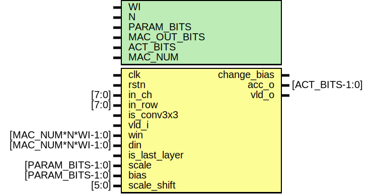

# Entity: conv_kern 

- **File**: conv_kern.v
## Diagram

## Description

 Module: conv_kern
 2023.03.05 by JUN, CHA (chamj61047@snu.ac.kr)

## Generics

| Generic name | Type | Value | Description                          |
| ------------ | ---- | ----- | ------------------------------------ |
| WI           |      | 8     | Input data width                     |
| N            |      | 16    | number of parallel computed channels |
| PARAM_BITS   |      | 16    | scale, bias bit width                |
| MAC_OUT_BITS |      | 24    | output bit width of MAC_KERN         |
| ACT_BITS     |      | 8     | output bit width                     |
| MAC_NUM      |      | 9     | number of mac used                   |
## Ports

| Port name     | Direction | Type               | Description              |
| ------------- | --------- | ------------------ | ------------------------ |
| clk           | input     |                    |                          |
| rstn          | input     |                    |                          |
| in_ch         | input     | [7:0]              | max 256                  |
| in_row        | input     | [7:0]              | max 256                  |
| is_conv3x3    | input     |                    | 3x3 conv or 1x1 conv     |
| vld_i         | input     |                    | valid input              |
| win           | input     | [MAC_NUM*N*WI-1:0] | weight input             |
| din           | input     | [MAC_NUM*N*WI-1:0] | data input               |
| is_last_layer | input     |                    | is last layer            |
| scale         | input     | [PARAM_BITS-1:0]   | scale value              |
| bias          | input     | [PARAM_BITS-1:0]   | bias value               |
| scale_shift   | input     | [5:0]              | scale shift value        |
| change_bias   | output    |                    |                          |
| acc_o         | output    | [ACT_BITS-1:0]     | accumulated output value |
| vld_o         | output    |                    | valid output signal      |
## Signals

| Name               | Type                    | Description |
| ------------------ | ----------------------- | ----------- |
| mac_kern_acc_o     | wire [MAC_OUT_BITS-1:0] |             |
| mac_kern_acc_vld_o | wire                    |             |
| mac_kern_o_counter | reg [7:0]               |             |
## Instantiations

- u_mac_kern: mac_kern
- u_bias_scale_act: bias_scale_act
